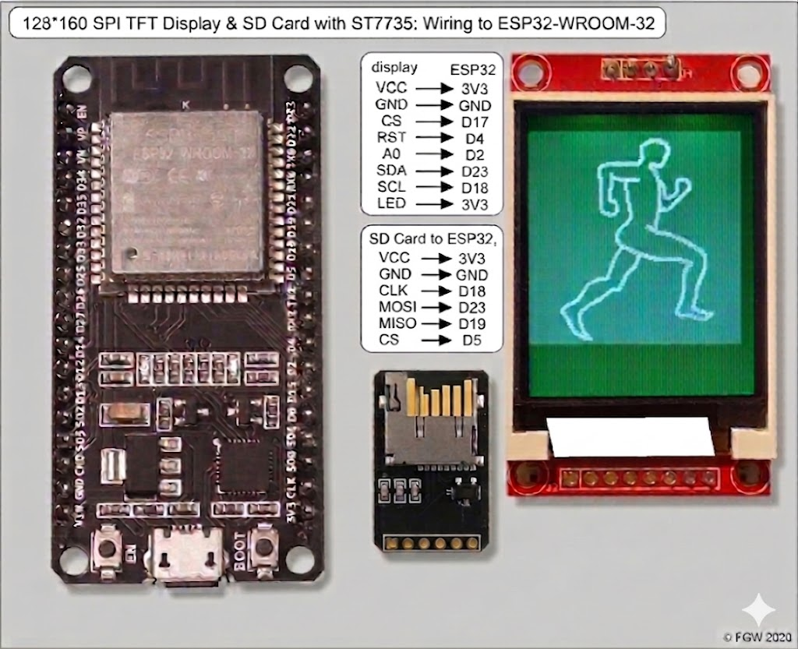

# ESP32 TFT Image Workflow (Pixlr → RGB565 → ESP32)
## Required Components
* [Aliexpress - SD Card](https://www.aliexpress.us/w/wholesale-sdcard-module.html?spm=a2g0o.productlist.search.0)
* [Aliexpress - ST7735 Display](https://www.aliexpress.us/w/wholesale-ST7735.html?spm=a2g0o.productlist.search.0)
* [Aliexpress - ESP32E Wroom](https://www.aliexpress.us/w/wholesale-ESP32E-Wroom.html?spm=a2g0o.productlist.search.0)

---

## Wiring Diagram

---

## Overview
This guide explains how to properly prepare images for ESP32 TFT displays (ST7735 / similar). It ensures correct resolution, format, and conversion to RGB565 for embedded use.

---

## 🖼️ Step 1: Upload Original Image to Pixlr

You must start with the **original image**.

Open Pixlr:
https://pixlr.com/editor/

### Instructions:
- Upload your original image
- Make sure it is high quality before editing

---

## 📐 Step 2: Resize Image

Inside Pixlr:

- Set image size to: **128 × 160 pixels**
- Match your TFT display resolution exactly
- Apply resize and confirm changes

⚠️ Important:
- Do NOT stretch randomly
- Maintain correct aspect ratio to avoid distortion

---

## 💾 Step 3: Save Image

- Export image as **PNG (recommended)** or JPG
- Save it locally on your computer
- This file is now ready for conversion

---

## 🔄 Step 4: Convert to RGB565

Use the RGB565 converter tool:

https://longfangsong.github.io/en/image-to-rgb565/

### Instructions:
- Upload your resized 128×160 image
- Convert to **RGB565 format**
- Download or copy the generated output

---

## 📦 Step 5: Use in ESP32 Project

You can now use the RGB565 data in your project:

### Renaming:
- Make sure to rename file matching the .ino code to `picture.raw` file and store on SD card
- Make sure total bytes is 40,960!  2 Bytes per pixels in ST7735.

### Display Flow:
ESP32 reads RGB565 data → sends via SPI → ST7735 displays image

---

## ⚠️ Important Rules

- Always resize to **128×160 before converting**
- Never convert full-size images directly
- Ensure correct byte order when displaying RGB565 data
- Mismatched width causes image repetition or distortion

